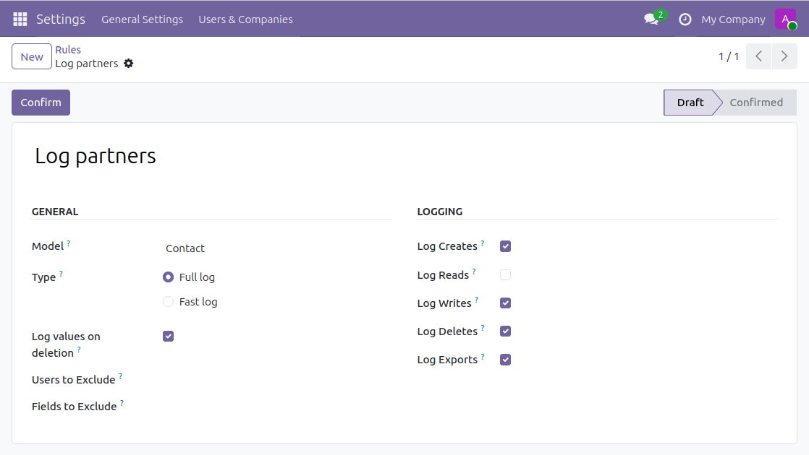
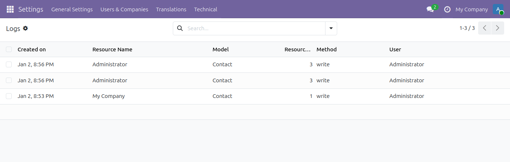
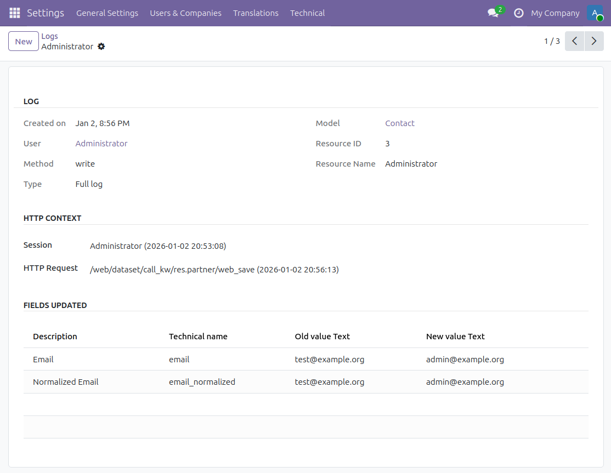
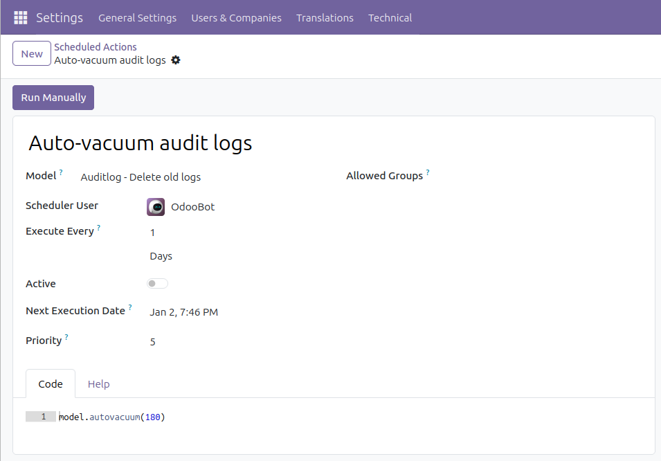

Go to Settings / Technical / Audit / Rules to manage audit log rules. A rule
defines which operations to log for a given data model. New rules need to be
enabled by 'Subscribing'.

Then, check logs in the Settings / Technical / Audit / Logs menu. You
can group them by user sessions, date, data model or HTTP requests:

Get the details:

A scheduled action exists to delete logs older than 6 months (180 days)
periodically but is not enabled by default. To activate it and/or
change the delay, go to the Configuration / Technical / Automation /
Scheduled Actions menu and edit the Auto-vacuum audit logs entry:

In case you're having trouble with the amount of records to delete per
run, you can pass the amount of records to delete for one model per run
as the second parameter. The default is to delete all records in one go.

There are two permission groups that apply to auditlogging. The
first is the Auditlog User group. This group has read-only access to the
auditlogs of individual records through the View Logs action that is available
on records of models that are being tracked. The second group is the Auditlog
Manager group. This group has additional rights to manage the auditlog
configuration rules. By default, users that are ERP Administrators are also
Auditlog Managers.
